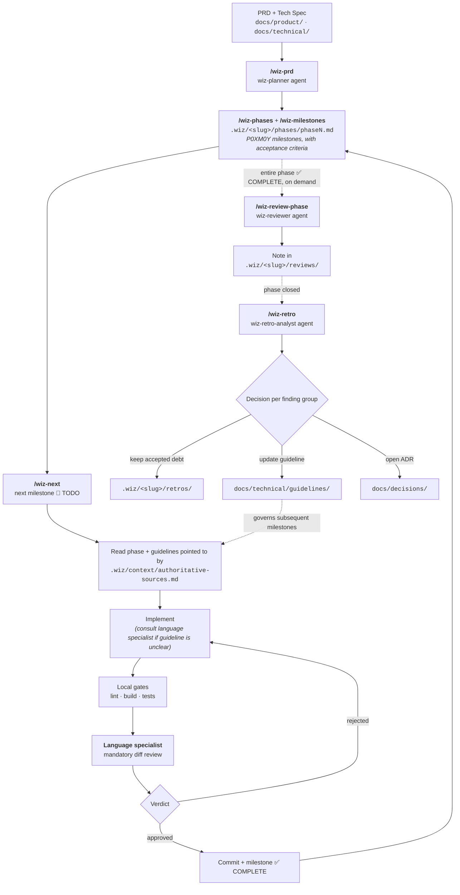

# Contributing to PayFlow Hub

Entry point for newcomers — human or a fresh AI session. This document does not repeat the others: it defines the reading order and the practical path to a first contribution.

## Reading, in order

Do not read everything at once — read in the order you will use it:

1. [`docs/product/PRD.md`](docs/product/PRD.md) — what the hub solves and for whom.
2. [`docs/technical/architecture/overview.md`](docs/technical/architecture/overview.md) — how the pieces fit together (includes why cash-in is synchronous and cash-out is asynchronous — the first question everyone asks).
3. [`CLAUDE.md`](CLAUDE.md) — repository scope rules. What not to do matters as much as what to do.
4. [`.claude/NOTICE.md`](.claude/NOTICE.md) — the PayFlow SDLC Kit (wiz-cursor fork): how work is organized (PRD → Phases → Milestones, `P0XM0Y` format) and conducted (`wiz-*` commands).
5. [`docs/technical/guidelines/`](docs/technical/guidelines/) — only the section for the group you will work in (CORE or Backoffice, see `coding-standards.md`), not the whole package.

`docs/technical/ai-augmented-sdlc.md`, `versioning.md`, `retrospective.md`, and `ai-process-metrics.md` are reference for when questions arise — not prerequisites for a first contribution.

## The workflow

[View editable diagram on Mermaid Live](https://mermaid.ai/live/edit#pako:eNp9Vc1u20YQfpXBHowWlUTJkq2fCAISSf6LZauJUbSJchhxV9SiJJfYXcqOJR_7EkGAHnookmsOAXKs3qRP0EfocGlTshOHECDuDL9vvvkjl8xXXLAOm4Xq0p-jtnAxmMRA19PXEzZ-MYCf4EL4c3iZCL871V6vmyF6XPnGS7TiqW-9ruds8M9n2PJagsXSx_DOP2FvoFzuwTNi7k573qW8Liead71pzzFjIGIrwJlDjGOhCZGLeeaA_W3gHI0wGZYU3hkjGQpjVZw7tuRWyOvthPaJCdNgJ7BPvByf_51VIn6rMcfI3oYJxtVfR9XfSuCrCHwt7fqDlgq4APSFtKLryV6hs-90DrZ0xuLKFmISvf50JSOEgh7--_Pd33BxPjgvOAaOY0gcp-uPgDAjhZRjkEouQpkpwkTFFjkaSJR-mKVPPorpYWrniuSilQtRNirVvjCbRItwQxfugMIdR0koIuoB3lXhByIzaWgRFAhDEyAxlIaOlD1JCVJqWQQkb67ShdDA118WkuOP92py4AIcUoBDtKQ-VD5K40IQh82mZprKkGc35KdfAT100KO8nMPHBBTl1WIhzfovBWqqZYB2_UlLepSaJWezgvTIkR4vfxFacGnVTW4-zswrLWioF8jVCg627ViYT0hNX0WRtNSUTR__ff8H9M9H49PhxbAIdZKPbTEbFWJy7aS8hdR4D1UCo6aUWIQxxxU83xqiLDFxmc_8t9Yl92_ty3MX-JQozhRVi2r0vV3I4cZ7OBqnW4pF7AutMVM2uqfMavVtSeQoY4zhW2MLxpHTdbYcUCddp2iAIdBpcrtQcyrxbT_OXN2pGNYN1ocptSpfOWrCeSbh0Wwo8tfJ5HxoU5qga9SbfVrBuGB78OLa7NxjdDRoGp4OXqzg5_skPMtQ0vp8hRznVU3QGKT11iKgBLNdvn05mM1UmRUMWYkFWnLWsToVJRYJHWF2ZMuMbsLsnHZ2wjp0y1H_PmGT-IYwCcavlIruYFqlwZx1ZhgaOqUJp1UcSAw0bh4RMRe6r9LYsk5td7_hSFhnya5YZ69Zq-zVa_vNVr3ZrlereyX2lnUarUqj3my0W639-n6zXd27KbFrF7VaaZGdrma70dxt12rtEnPbpkf5B8d9d27-B4VEJ14)

The **mandatory review before commit**, within `/wiz-next`, is done by the language specialist — a local code-pattern check, not a full NFR audit. `/wiz-review-milestone` and `/wiz-review-phase` (agent `wiz-reviewer`) are the formal audit, run on demand when a milestone or entire phase must be verified against P0–P4. The dashed arrow at the bottom closes the cycle: a retro finding that becomes a guideline goes back to govern subsequent milestones. Without it, the same lesson would be relearned every phase.

## Your first milestone

Planned work is conducted via `/wiz-next [slug]`. It is worth understanding what the command does before running it — if you do not know what happens under the hood, you will not notice when something goes wrong:

1. Locates the next 🚧 `TODO` milestone in `.wiz/<slug>/phases/`, in the current phase.
2. Loads local context: the phase document, the milestone, and the guidelines pointed to by `.wiz/context/authoritative-sources.md` — which replaces "remembering" the convention; the rule is loaded from source, every time.
3. Checks the milestone **acceptance criteria**. If it is not objectively verifiable ("must work well" is not), stop and adjust the criteria before implementing — see Definition of Ready in `docs/technical/quality/qa-guidelines.md`.
4. Consult the language specialist (`wiz-typescript-specialist`, `wiz-go-specialist`, etc.) when applying the guideline is unclear.
5. Implement and run local gates: lint, build, tests (`docs/technical/ci-cd.md`, `scripts/pre-commit.sh`).
6. The language specialist reviews the diff **before commit** — mandatory, not optional. A rejected verdict requires correction and a new review.
7. Commit using Conventional Commits and update milestone status to `✅ COMPLETE`, referencing the commit.
8. When you want a formal audit against NFR gates (not just the specialist), run `/wiz-review-milestone <slug> <id>` — the note goes to `.wiz/<slug>/reviews/`.

If you need to run any step manually, this is the same playbook — order and gates do not change.

## Work outside a milestone

Bug fix, technical investigation, ad-hoc documentation update: does not go through `wiz-*` commands. Here the prompt is assembled on the spot, and the structure that keeps quality predictable is in [`docs/technical/prompt-engineering.md`](docs/technical/prompt-engineering.md) — especially the rule that **context and verification come before output**.

If the work reveals something that should become a milestone (scope change, structured refactor), stop and plan with `/wiz-prd` instead of continuing ad hoc.

## Common mistakes

- **Overly generic types slipping through** (`any`/`unknown` without justification, `interface{}` in Go) — lint catches it, but only if you run it before specialist review.
- **Infrastructure dependency embedded in the class** instead of injected behind an interface — works short term, becomes an expensive refactor when the implementation changes. See `docs/technical/guidelines/dependency-injection.md`. A finding of this type that repeats across two milestones in the same phase is exactly what a retrospective (`/wiz-retro`) should catch.
- **E2E tests sharing state unnoticed** — `beforeAll` that boots the app once hides order dependency between tests.
- **Trusting that the AI "remembers" a previous session** — it does not. If the convention is not in a file referenced by `.wiz/context/authoritative-sources.md` or `CLAUDE.md`, it does not exist for the next session. See `docs/technical/prompt-engineering.md`, section "Context window management".

## When to escalate instead of deciding alone

- A finding that **repeats** in a second milestone of the same phase — stops being an individual decision and becomes a signal for retrospective (`docs/technical/retrospective.md`, `/wiz-retro`).
- API or event contract change — requires updating `docs/contract/contract.md` in the same PR, never later.
- Architecture decision with a real trade-off (not just style) — becomes an ADR in `docs/decisions/`, not prose in a service README.

## You are ready to work independently when

1. You have read the documents in the "Reading, in order" section.
2. You have delivered a milestone end to end without needing to ask the process step by step.
3. You can distinguish a finding that becomes accepted technical debt from one that requires stopping and fixing before commit — and you know when a repeated finding should become a guideline instead of staying debt again.
