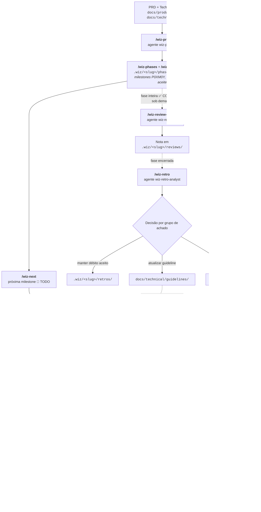

# Contribuindo com o PayFlow Hub

Ponto de entrada para quem está chegando — humano ou uma sessão nova de IA. Este documento não repete o conteúdo dos outros: define a ordem de leitura e o caminho prático da primeira contribuição.

## Leitura, em ordem

Não leia tudo de uma vez — leia na ordem em que vai usar:

1. [`docs/product/PRD.md`](docs/product/PRD.md) — o que o hub resolve e para quem.
2. [`docs/technical/architecture/overview.md`](docs/technical/architecture/overview.md) — como as peças se encaixam (inclui por que cash-in é síncrono e cash-out é assíncrono — a primeira pergunta que todo mundo faz).
3. [`CLAUDE.md`](CLAUDE.md) — regras de escopo do repositório. O que não fazer importa tanto quanto o que fazer.
4. [`.claude/NOTICE.md`](.claude/NOTICE.md) — o PayFlow SDLC Kit (fork do wiz-cursor): como o trabalho é organizado (PRD → Fases → Milestones, formato `P0XM0Y`) e conduzido (comandos `wiz-*`).
5. [`docs/technical/guidelines/`](docs/technical/guidelines/) — só a seção do grupo em que você vai trabalhar (CORE ou Backoffice, ver `coding-standards.md`), não o pacote inteiro.

`docs/technical/ai-augmented-sdlc.md`, `versioning.md`, `retrospective.md` e `ai-process-metrics.md` são referência para quando a dúvida aparecer — não pré-requisito da primeira contribuição.

## O workflow

[Ver diagrama editável no Mermaid Live](https://mermaid.ai/live/edit#pako:eNp9Vc1u20YQfpXBHowWlUTJkq2fCAISSf6LZauJUbSJchhxV9SiJJfYXcqOJR_7EkGAHnookmsOAXKs3qRP0EfocGlTshOHECDuDL9vvvkjl8xXXLAOm4Xq0p-jtnAxmMRA19PXEzZ-MYCf4EL4c3iZCL871V6vmyF6XPnGS7TiqW-9ruds8M9n2PJagsXSx_DOP2FvoFzuwTNi7k573qW8Liead71pzzFjIGIrwJlDjGOhCZGLeeaA_W3gHI0wGZYU3hkjGQpjVZw7tuRWyOvthPaJCdNgJ7BPvByf_51VIn6rMcfI3oYJxtVfR9XfSuCrCHwt7fqDlgq4APSFtKLryV6hs-90DrZ0xuLKFmISvf50JSOEgh7--_Pd33BxPjgvOAaOY0gcp-uPgDAjhZRjkEouQpkpwkTFFjkaSJR-mKVPPorpYWrniuSilQtRNirVvjCbRItwQxfugMIdR0koIuoB3lXhByIzaWgRFAhDEyAxlIaOlD1JCVJqWQQkb67ShdDA118WkuOP92py4AIcUoBDtKQ-VD5K40IQh82mZprKkGc35KdfAT100KO8nMPHBBTl1WIhzfovBWqqZYB2_UlLepSaJWezgvTIkR4vfxFacGnVTW4-zswrLWioF8jVCg627ViYT0hNX0WRtNSUTR__ff8H9M9H49PhxbAIdZKPbTEbFWJy7aS8hdR4D1UCo6aUWIQxxxU83xqiLDFxmc_8t9Yl92_ty3MX-JQozhRVi2r0vV3I4cZ7OBqnW4pF7AutMVM2uqfMavVtSeQoY4zhW2MLxpHTdbYcUCddp2iAIdBpcrtQcyrxbT_OXN2pGNYN1ocptSpfOWrCeSbh0Wwo8tfJ5HxoU5qga9SbfVrBuGB78OLa7NxjdDRoGp4OXqzg5_skPMtQ0vp8hRznVU3QGKT11iKgBLNdvn05mM1UmRUMWYkFWnLWsToVJRYJHWF2ZMuMbsLsnHZ2wjp0y1H_PmGT-IYwCcavlIruYFqlwZx1ZhgaOqUJp1UcSAw0bh4RMRe6r9LYsk5td7_hSFhnya5YZ69Zq-zVa_vNVr3ZrlereyX2lnUarUqj3my0W639-n6zXd27KbFrF7VaaZGdrma70dxt12rtEnPbpkf5B8d9d27-B4VEJ14)

A revisão **obrigatória antes do commit**, dentro de `/wiz-next`, é feita pelo especialista de linguagem — um check local de padrão de código, não uma auditoria completa de NFRs. `/wiz-review-milestone` e `/wiz-review-phase` (agente `wiz-reviewer`) são a auditoria formal, rodada sob demanda quando uma milestone ou fase inteira precisa ser verificada contra P0–P4. A seta tracejada de baixo é o que fecha o ciclo: um achado de retro que vira guideline volta a reger as milestones seguintes. Sem ela, a mesma lição seria reaprendida a cada fase.

## Sua primeira milestone

Trabalho planejado é conduzido por `/wiz-next [slug]`. Vale entender o que o comando faz antes de rodá-lo — se você não sabe o que acontece por baixo, não vai perceber quando algo sair errado:

1. Localiza a próxima milestone 🚧 `TODO` em `.wiz/<slug>/phases/`, na fase atual.
2. Carrega o contexto local: o documento da fase, a milestone, e as guidelines apontadas por `.wiz/context/authoritative-sources.md` — que é o que substitui "lembrar" da convenção; a regra é carregada da fonte, toda vez.
3. Confere o **critério de aceite** da milestone. Se não for verificável objetivamente ("deve funcionar bem" não é), o certo é parar e ajustar o critério antes de implementar — ver Definition of Ready em `docs/technical/quality/qa-guidelines.md`.
4. Consulta o especialista de linguagem (`wiz-typescript-specialist`, `wiz-go-specialist`, etc.) quando a aplicação da guideline deixa dúvida.
5. Implementa e roda os gates locais: lint, build, testes (`docs/technical/ci-cd.md`, `scripts/pre-commit.sh`).
6. O especialista de linguagem revisa o diff **antes do commit** — é mandatório, não opcional. Veredito reprovado exige correção e nova revisão.
7. Commit em Conventional Commits e status da milestone atualizado para `✅ COMPLETE`, referenciando o commit.
8. Quando quiser uma auditoria formal contra os gates de NFR (não só o especialista), rode `/wiz-review-milestone <slug> <id>` — a nota vai para `.wiz/<slug>/reviews/`.

Se precisar executar algum passo à mão, o roteiro é esse mesmo — a ordem e os gates não mudam.

## Trabalho fora de milestone

Correção de bug, investigação técnica, ajuste pontual de documentação: não passa pelos comandos `wiz-*`. Aqui o prompt é montado na hora, e a estrutura que mantém a qualidade previsível está em [`docs/technical/prompt-engineering.md`](docs/technical/prompt-engineering.md) — em especial a regra de que **contexto e verificação vêm antes do output**.

Se o trabalho revelar algo que deveria virar milestone (mudança de escopo, refactor estruturado), pare e planeje com `/wiz-prd` em vez de continuar ad-hoc.

## Erros comuns

- **Tipo genérico demais escapando** (`any`/`unknown` sem justificativa, `interface{}` em Go) — o lint pega, mas só se você rodar antes da revisão do especialista.
- **Dependência de infraestrutura embutida na classe** em vez de injetada atrás de interface — funciona no curto prazo, vira refactor caro quando a implementação muda. Ver `docs/technical/guidelines/dependency-injection.md`. Um achado desse tipo que se repete em duas milestones da mesma fase é justamente o que uma retrospectiva (`/wiz-retro`) deve pegar.
- **Testes e2e compartilhando estado sem perceber** — `beforeAll` que sobe a aplicação uma vez esconde dependência de ordem entre testes.
- **Confiar que a IA "lembra" de uma sessão anterior** — não lembra. Se a convenção não está em um arquivo referenciado por `.wiz/context/authoritative-sources.md` ou em `CLAUDE.md`, ela não existe para a sessão seguinte. Ver `docs/technical/prompt-engineering.md`, seção "Gestão de janela de contexto".

## Quando escalar em vez de decidir sozinho

- Achado que **se repete** em uma segunda milestone da mesma fase — deixa de ser decisão individual e vira sinal para retrospectiva (`docs/technical/retrospective.md`, `/wiz-retro`).
- Mudança de contrato de API ou evento — exige atualizar `docs/contract/contract.md` no mesmo PR, nunca depois.
- Decisão arquitetural com trade-off real (não só estilo) — vira ADR em `docs/decisions/`, não fica em prosa num README de serviço.

## Você está pronto para trabalhar sozinho quando

1. Leu os documentos da seção "Leitura, em ordem".
2. Entregou uma milestone de ponta a ponta sem precisar perguntar o processo passo a passo.
3. Sabe distinguir um achado que vira débito técnico aceito de um que exige parar e corrigir antes do commit — e sabe quando um achado repetido deve virar guideline em vez de ficar como débito de novo.
